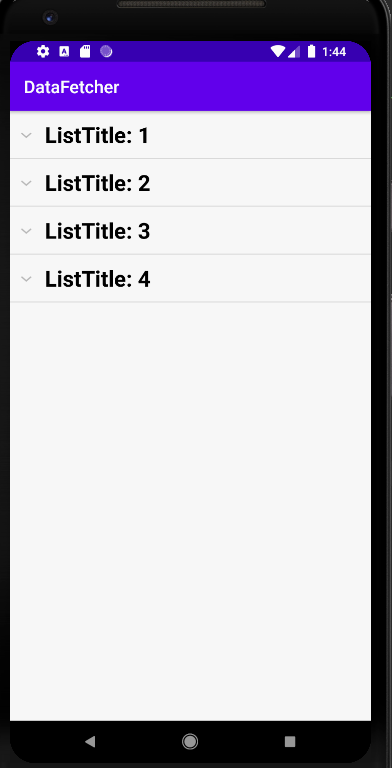
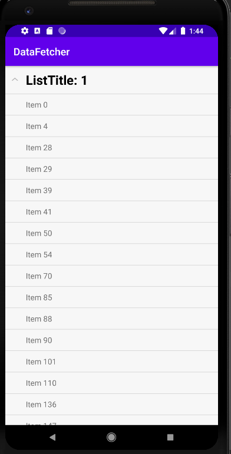
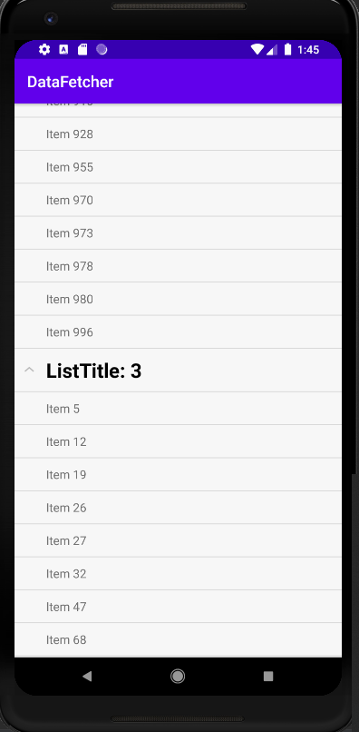
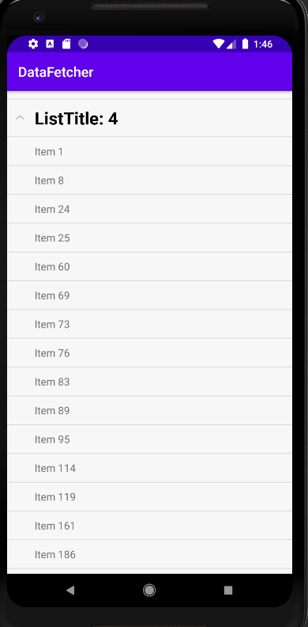

# DataFetcher

## Description: Developed an Android Application in Java using the MVVM and Repository pattern to fetch data from an API endpoint.

## Steps to run the project:
1. Clone the repository using the following command: 
```git clone https://github.com/Mk09878/DataFetcher.git```
2. Open AndroidStudio, Click on open and then select DataFetcher
3. In order to run the application just click on the green button on the top
4. In order to run the tests, navigate to the test folder and run the file

## Project Structure:
### The java directory consists of the following
1. The adapters directory consists of the CustomExpandableListAdapter class which acts as a bridge between an AdapterView and the underlying data for that view.
2. The api directory consists of ItemApi interface whose methods actually fetch data. However, concrete implementation of these methods is provided by retrofit
3. The models directory consists of Item class acting as a DataModel storing the data obtained from api in its attributes.
4. The repositories directory consists of ItemRepository class which encapsulates the logic required to access the api thereby following the repository pattern.
5. The viewmodels directory consists of ItemViewModel class which retrieves the necessary data from the DataModel and then exposes relevant data for the View to consume.
6. The utils directory consists of DataProcessing class which does the following tasks:
- Filters out items with name as "" or null
- Groups items by listId and sorts the listId
- Sorts the items in a listId by name
7. MainActivity class which is the starting point of the appication and which listens for changes in the live data.

### The layout directory in the resource directory consists of the following
1. activity_main.xml houses the expandable list view.
2. list_group represents the group (parent) in the list view.
3. list_item represents the child items in the list view.

## MVVM architecture

Image Credits: https://developer.android.com/jetpack/guide

From the project structure and this image we can see that this application follows this pattern with the exception of the ROOM section.

## Screenshots









## Future improvements
1. Could develop the application in kotlin.
2. Could add sticky headers for the group items.
3. Could add unit test cases for the retrofit api calls.


